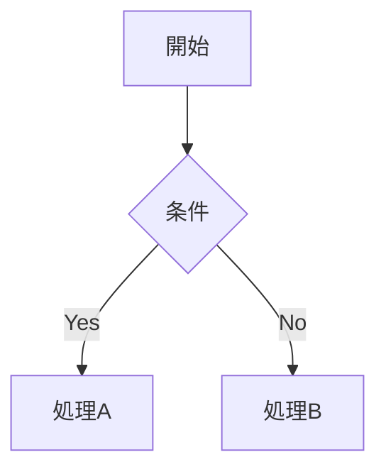

# Markdown Editor & Viewer

## 使い方

**ブラウザで開くだけで使えます（インストール不要）:**

👉 **https://kazuhiko-kobayashi-dnjp.github.io/md_editer_and_viewer/**

---

## 機能

- **左ペイン**: Markdownを編集（シンタックスハイライト付き）
- **右ペイン**: リアルタイムプレビュー
- **スクロール連動**: 左右が行単位で同期してスクロール
- **仕切りのドラッグ**: 左右の幅を自由に調整可能
- **ファイルを開く**: ローカルの `.md` ファイルを読み込める（Chrome / Edge のみ）
- **保存 / 名前を付けて保存**: ローカルファイルに直接書き出し（Chrome / Edge のみ）、`Ctrl+S` で上書き保存
- **Mermaid対応**: フローチャート・シーケンス図をコードブロックで描画

### Mermaid の書き方例

~~~markdown

~~~

---

## ブラウザ対応

| 機能 | Chrome / Edge | Firefox / Safari |
|------|:---:|:---:|
| 編集・プレビュー | ✅ | ✅ |
| ファイルを開く / 保存 | ✅ | ❌ |

ファイルの開く・保存は [File System Access API](https://developer.mozilla.org/en-US/docs/Web/API/File_System_Access_API) を使用しているため Chrome / Edge 限定です。

---

## 開発者向け

```bash
git clone https://github.com/kazuhiko-kobayashi-dnjp/md_editer_and_viewer.git
cd md_editer_and_viewer
npm install
npm run dev        # 開発サーバー起動 → http://localhost:5173/
npm run build      # 本番ビルド
npm run deploy     # GitHub Pages へデプロイ
```
